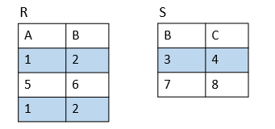

## Bag

bag는 set과 비슷하지만 원소가 중복해서 여러번 나올 수 있으며 'Multiset' 이라고도 부른다

- {1,2,1,3} 은 **bag** 이다.

- {1,2,3} 은 bag 이면서 **set** 이다. 

bag 에서 순서는 고려하지 않는다. 즉, {1,2,1} = {1,1,2} 이다. 

#### 왜 Bag를 알아야 할까?

- DB의 가장 중요한 Query Language 인 **SQL은 Bag Language**이다. 

- projection과 같은 연산은 set에서 보다 bag에서 더 효율적이다. 

### :pushpin:Bag 연산

#### selection

조건에 맞는 튜플만 출력한다.

각각의 튜플에 적용하므로 set에서의 연산과 똑같다. 중복된 튜플은 중복해서 표시한다.

#### projection

특정한 속성만 가져와서 보여주고 중복을 제거하지 않는다. 

#### products

두 테이블을 서로 모두 교차하여 합친다. 

 각각의 튜플에 대해서 합쳐지므로 중복은 그대로 둔다. 

#### join

공통된 속성을 가진 튜플들을 합쳐서 새로운 테이블을 만든다. 

중복은 그대로 둔다. 

#### union, intersection, difference

Union : {1,2,1}  ∩  {1,1,2,3,1} = {1,1,1,1,1,2,2,3}

Intersection : {1,2,1} ∪{1,2,3} = {1,2}

Difference : {1,2,1} - {1,2,3} = {1}

#### Grouping Operator

#### Outerjoin

join과 같이 공통된 속성에 대해서 두 테이블을 합친다.

이 때 공통된 속성의 열을 하나로 통합 시키고 나머지 속성값이 없더라도 

표시를 해둔다. 

### :pushpin:모든 bag 연산이 set연산과 같진 않다!

예를 들어 합집합에서 

set은 {1,2} ∪ {1,2} = {1,2} 이지만

bag는 {1,2} ∪ {1,2} = {1,1,2,2} 이다.  
