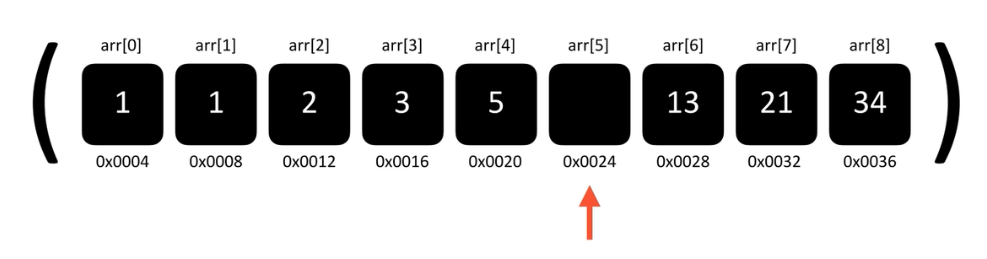
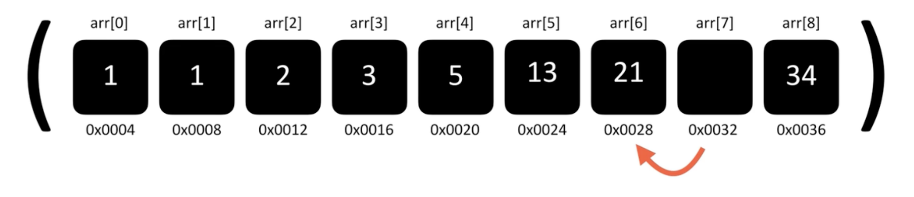
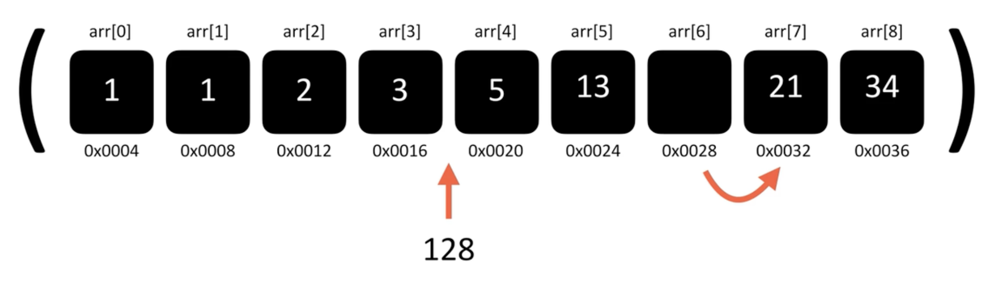

# 배열

연관된 데이터를 연속적인 형태로 구성된 구조를 가진다. 배열에 포함된 원소는 순서대로 번호(index)가 붙는다. 

## 1. 배열의 특징

- 고정된 크기를 가지며 일반적으론 동적으로 크기를 늘릴 수 없다. (c 와 같은 컴파일 언어)
  
  - 자바스크립트처럼 대부분의 스크립트 언어는 동적으로 크기가 증감되도록 만들어져 있다.

- 원하는 원소의 index를 알고 있다면 O(1)로 원소를 찾을 수 있다.

- 원소를 삭제하면 해당 index에 빈자리가 생긴다.

> **배열 요소 삭제** 
> 
> 
> 
> 배열의 요소가 삭제되면 위 사진과 같이 빈 자리가 생기게 된다. 
> 
> 
> 
> 배열을 최적화된 상태로 만들려면 뒤의 원소를 하나씩 앞당겨와야 한다. 
> 
> 이때 순서를 맞추기 위해 **O(n)** 의 시간이 소요된다.

> **배열 요소 삽입추가**
> 
> 
> 
> 
> 
> 배열에 새로운 요소를 삽입할때는 요소들을 뒤로 미루어 공간을 만들고 그 자리에 넣는다.
> 
> 이때 공간을 만들기 위해 **O(n)** 의 시간이 소요된다. 

**따라서 <mark>추가</mark>와 <mark>삭제</mark>가 반복되는 로직이라면 배열 사용을 권장하지 않는다 !** 

**<mark>탐색</mark>이 많을 때 더욱 유리하다** 

# 
