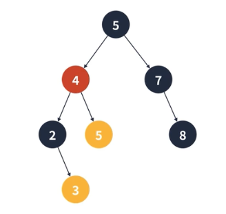

# 이진 탐색

**선형 탐색**

순서대로 하나씩 찾는 탐색 알고리즘, O(n) 시간복잡도가 걸린다


**이진 탐색**

정렬 되어있는 요소들을 반씩 제외하며 찾는 알고리즘, O(logn)만큼 시간복잡도가 걸린다.

 **이진 탐색의 특징**

- 반드시 정렬이 되어있어야 사용할 수 있다.

- 배열 혹은 이진 트리를 이용하여 구현할 수 있다.

- O(logn) 시간복잡도인 만큼 상당히 빠르다.

## 1. 배열을 이용한 구현 방법


## 2. 이진 탐색 트리를 이용한 구현 방법

**이진 탐색 트리**

이진 탐색을 위한 이지 트리로 왼쪽 서브 트리는 루트보다 작은 값이 모여있고, 오른쪽 서브 트리는 루트보다 큰 값이 모여있다.


## 3. 이진 탐색 트리 요소 추가

1. 처음 요소는 루트에 들어간다

2. 다음 요소 부터는 루트에서 부터 비교해 내려오며 루트보다 작으면 왼쪽 서브트리로 루트보다 크면 오른쪽 서브트리로 내려간다.

3. 이를 반복한다.

## 4. 이진 탐색 트리 요소 삭제

**단말정점(리프노드)를 삭제하는 경우**

별다른 처리 없이 부모 정점과의 연결을 끊으면 된다.


**하나의 서브 트리를 가지는 경우**

제거되는 정점의 부모 간선을 자식 정점을 가르키게 바꾸면 된다.


**두 개의 서브 트리를 가지는 경우**

왼쪽 서브 트리의 가장 큰 값 혹은 오른쪽 서브 트리의 가장 작은 값과 교체하면 된다. 이 경우 교체된 정점의 좌우 자식이 없다면 제거되는 정점의 링크로 대체된다.



## 5. 이진 탐색 트리의 문제점

- 최악의 경우 한쪽으로 편향된 트리가 될 수 있다

- 그런 경우 순차 탐색과 동일한 시간복잡도를 가진다.

- 이를 해결하기 위해 다음과 같은 자료구조를 이용할 수 있다.

  - AVL 트리

  - 레드-블랙 트리

## 6. Javascript에서의 사용법

**배열을 이용한 방법**

<mark>코딩 테스트</mark>에서는 주로 이 방법을 이용한다

```js
const array = [1, 1, 5, 124, 400, 599, 1004, 2876, 8712];

function binarySearch(array, findValue) {
  let left = 0;
  let right = array.length - 1;
  let mid = Math.floor((left + right) / 2);
  while (left < right) {
    if (array[mid] === findValue) {
      return mid;
    }

    if (array[mid] < findValue) {
      left = mid + 1;
    } else {
      right = mid - 1;
    }

    mid = Math.floor((left + right) / 2);
  }

  return -1;
}
```

**이진 탐색 트리를 이용하는 방법**

```js
class Node {
  constructor(value) {
    this.value = value;
    this.left = null;
    this.right = null;
  }
}

class BinarySearchTree {
  constructor() {
    this.root = null;
  }

  insert(value) {
    const newNode = new Node(value);
    if (this.root === null) {
      this.root = newNode;
      return;
    }

    let currentNode = this.root;
    while (currentNode !== null) {
      if (currentNode.value < value) {
        if (currentNode.right === null) {
          currentNode.right = newNode;
          break;
        }
        currentNode = currentNode.right;
      } else {
        if (currentNode.left === null) {
          currentNode.left = newNode;
          break;
        }
        currentNode = currentNode.left;
      }
    }
  }

  has(value) {
    let currentNode = this.root;
    while (currentNode !== null) {
      if (currentNode.value === value) {
        return true;
      }

      if (currentNode.value < value) {
        currentNode = currentNode.right;
      } else {
        currentNode = currentNode.left;
      }
    }
    return false;
  }
}
```
